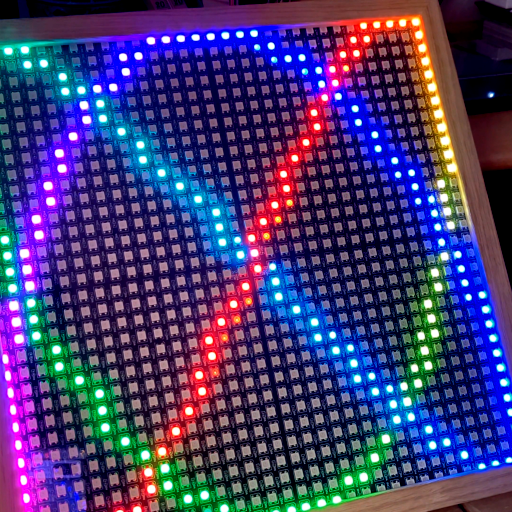

# ESPHome Elements

[](https://github.com/renggli/esphome-elements/actions/workflows/ci.yml)
[](https://github.com/renggli/esphome-elements/issues)
[](https://github.com/renggli/esphome-elements/network)
[](https://github.com/renggli/esphome-elements/stargazers)
[](https://raw.githubusercontent.com/renggli/esphome-elements/main/LICENSE)

Control and personalize your LED matrix display with [ESPHome](https://esphome.io) Elements, a custom component for configuring dynamic text, images, animations, and more.

## Basic Setup

To integrate _ESPHome Elements_ into your project, simply add the following to your ESPHome configuration file:

```yaml
external_components:
  - source: github://renggli/esphome-elements
```

Next, define a [Addressable Light Component](https://esphome.io/components/light/index.html) that is connected to an [Addressable Light Display](https://esphome.io/components/display/addressable_light.html). Configure both parts according to your display hardware. You do not need to define a `lambda` for rendering, as _ESPHome Elements_ will manage the display updates.

```yaml
light:
  # configuration of addressable light component
  - id: led_light
    ...

display:
  # configuration of addressable light display
  - platform: addressable_light
    id: led_display
    addressable_light_id: led_light
    ...
```

Finally, define the `elements` configuration block. This is where you'll bring your display to life. Here's an example showing the default animation:

```yaml
elements:
  id: elements_display
  display: led_display
  element:
    - type: custom
```

[](https://www.youtube.com/shorts/Ih7tS33tRmk)

For a complete configuration example demonstrating various features, refer to the [example.yaml](example.yaml) file.
